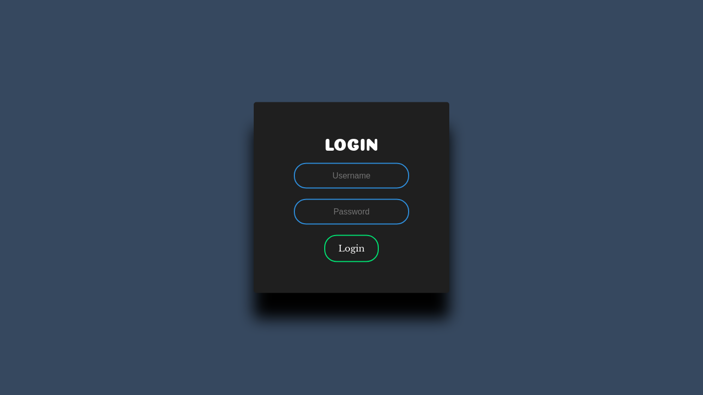

# Login-Page-Html-and-Css
Login Page made with Html and Css.
The Contents of the form are created using HTML and are in the Login-Page.html File.
The Styling of the HTML elements is done with CSS and can be found in the Login-Page.css File
The Login-Page.png file consist of the final Output obtained.

